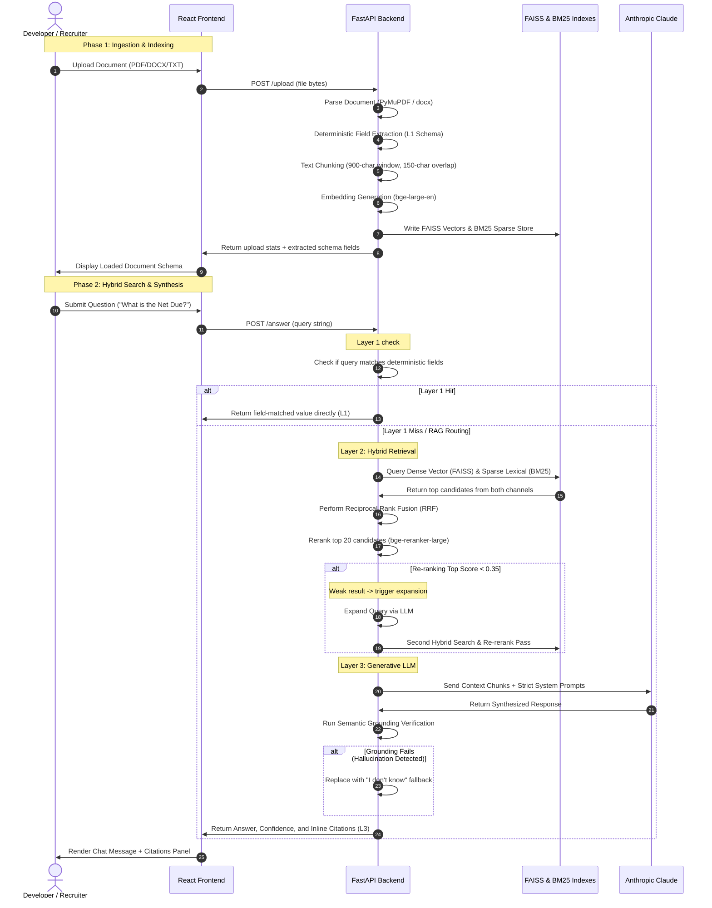

# Architecture Blueprint: InsightRAG

This document outlines the end-to-end data flow, sequencing, and underlying machine learning modules that power InsightRAG.

---

## High-Level System Flow

The diagram below represents the step-by-step lifecycle of an uploaded document and the subsequent multi-layered query resolution sequence:

---

## Core System Components

### 1. Document Ingestion Engine
- **Parsing:** Custom parser handles `.pdf`, `.docx`, and `.txt` documents. For PDFs, PyMuPDF is configured to extract text by blocks rather than raw streams, preserving document formatting and table layouts.
- **Layer 1 Metadata Scan:** A heuristic-based pattern matcher scans document pages immediately after parsing. It maps structural text coordinates to common business schemas (Invoices, Purchase Orders, Contracts) to extract absolute entities like total amounts, contract dates, and signee names.

### 2. The Vector Database & Indexing Layer
- **Dense Representation:** Chunks of 900 characters are mapped to dense embeddings using `BAAI/bge-large-en` (1024-dimensional model). This model captures rich semantic relationships and conceptual meanings behind the text.
- **Index Engine:** Dense vectors are managed locally using **FAISS** (Facebook AI Similarity Search), utilizing an optimized flat L2 Index for exact distance scoring.
- **Sparse Representation:** Persisted chunk metadata is indexed under a custom **BM25** sparse parser using a tokenized stopword-filtered model. This guarantees that exact keyword queries (such as alphanumeric serial numbers or specific section numbers) are perfectly retrieved.

### 3. Reciprocal Rank Fusion (RRF) & Cross-Encoder Reranking
- **Rank Merging:** Scores from vector distance and BM25 token frequencies cannot be mathematically unified directly. To solve this, the system implements RRF with a standard constant $k=60$. It ranks chunks based on their relative positions in both search results, ensuring a balanced, high-recall candidate pool.
- **Cross-Encoder Reranking:** The top 20 candidates are passed to `BAAI/bge-reranker-large`. This model evaluates the full attention mapping between the query and context chunk in a single pass, outputting a precise semantic score between `0.0` and `1.0`. Only the top 5 chunks are selected for the LLM.

### 4. Claude 3.5 Sonnet Synthesis & Grounding
- **In-Context Prompting:** The top 5 reranked chunks are sent to Claude 3.5 Sonnet within a highly restricted context template. Claude is directed to acts as a strict QA search engine, utilizing inline source citations (`[source - page]`) and resorting to the fallback phrase `"I don't know"` if the context is insufficient.
- **Anti-Hallucination Guardrails:** A semantic grounding module validates that every assertion, numerical value, or proper noun in the generated response appears explicitly in the source retrieval passages. If any ungrounded text is identified, the response is rejected in favor of the safe fallback, ensuring enterprise-grade factual reliability.
