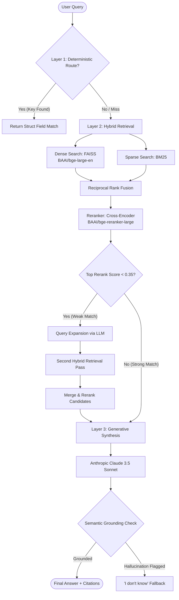

# System Design: InsightRAG 3-Layer Document QA Pipeline

This document details the architectural design and algorithms driving InsightRAG, the retrieval-augmented generation question-answering system. The system implements a robust, three-layer query resolution strategy to provide deterministic structure parsing, high-recall semantic search, and context-grounded AI synthesis.

---

## Architectural Overview

The core design philosophy is to achieve **high precision, high recall, and zero hallucinations** when answering questions from structured documents (such as invoices, contracts, statements, and financial reports). To achieve this, query resolution is handled through three distinct layers:

---

## Layer 1: Deterministic Field Extraction & Routing

Many business queries targeting financial documents, invoices, or legal contracts are looking for exact metadata (e.g., *“What is the invoice number?”*, *“When was the agreement signed?”*, *“Who is the vendor?”*). Relying on semantic vector retrieval or generative models for these queries introduces unnecessary latency and risks hallucinations.

### 1. Ingestion-Time Document Parsing
When a document is uploaded, it is ingested using specialized loaders:
- **PDFs:** PyMuPDF (`fitz`) extracts text blocks along with coordinates and page numbers.
- **DOCXs:** Python-docx extracts paragraphs and tables.
- **TXTs:** Standard text files are read line by line.

During this parse phase, a metadata extraction engine runs pre-defined heuristic rule sets to scan the extracted text and identify key deterministic fields:
- `invoice_number`
- `billing_date`
- `amount_due`
- `vendor_name`
- `client_name`
- `payment_terms`

### 2. Query Routing
At query time, the system uses semantic router mapping (`app/retrieval/router.py`) to determine if the query maps to one of these predefined schema fields. If a route matches (e.g., a query asking for "the date of the invoice" routes to `billing_date`), the system retrieves the value directly from the structured document state, bypassing the heavy retriever and generator models entirely.

---

## Layer 2: Hybrid Retrieval & Cross-Encoder Reranking

For semantic, analytical, or open-ended questions that do not map to structured metadata fields (e.g., *“What are the limitations of liability in Section 4?”*), the query is routed to a multi-stage retrieval pipeline.

### 1. Text Chunking
Documents are broken down into overlapping passages using a token-length window:
- **Chunk Size:** 900 characters (~150-200 words)
- **Overlap:** 150 characters (ensures semantic continuity across chunk borders)
- **Metadata Association:** Each chunk is tagged with its parent document name, page number, and a unique UUID.

### 2. Dual-Channel (Hybrid) Search
To capture both exact-match keyword coordinates and deep conceptual meaning, the system performs a parallel dual-channel search:
- **Dense Channel:** Text chunks are transformed into 1024-dimensional vector embeddings using the high-performance `BAAI/bge-large-en` model via SentenceTransformers. Embedding search is carried out locally using an optimized **FAISS** index.
- **Sparse Channel:** Lexical search is performed using the **BM25** algorithm (via the `rank_bm25` module) built on tokenized representations of the persisted document chunks.

### 3. Reciprocal Rank Fusion (RRF)
The candidates retrieved from the Dense channel ($D$) and Sparse channel ($S$) are merged into a single ranked list using Reciprocal Rank Fusion (RRF). RRF scores candidates based on their ranks in both retrieval lists, bypassing the need to normalize scores across completely different mathematical models:

$$RRF\_Score(d) = \sum_{m \in \{Dense, Sparse\}} \frac{1}{k + r_m(d)}$$

Where $k = 60$ (constant) and $r_m(d)$ is the rank of document $d$ in channel $m$.

### 4. Cross-Encoder Reranking
Dense retrieval is excellent for conceptual recall but can surface irrelevant chunks due to semantic overlap. To isolate the most contextually active chunks, candidates are passed through a cross-encoder model `BAAI/bge-reranker-large`.
Unlike bi-encoders (which encode queries and documents separately), a cross-encoder performs joint self-attention over the *query and chunk combined*, generating a highly accurate relevance score.

### 5. Multi-Pass Retrieval & Query Expansion
If the top candidate's rerank score is below `WEAK_RESULT_RERANK_SCORE = 0.35`, retrieval is flagged as "weak". This triggers a secondary pass:
1. **Query Expansion:** The system uses a prompt routine to re-phrase the query, broadening search terms.
2. **Re-Retrieval:** The expanded query is executed against the hybrid retrieval indexes.
3. **Merge & Rerank:** The candidates from both passes are unified and reranked, significantly improving retrieval under vague or poorly phrased search terms.

---

## Layer 3: Context-Grounded Generative Synthesis

Once the top 5 chunks are selected and validated, they are compiled into a highly constrained prompt context and sent to **Anthropic Claude 3.5 Sonnet**.

### 1. In-Context Constraints & Prompt Design
The prompt is configured with strict instructions to prevent hallucination:
- Only answer using the provided text blocks.
- If the answer is not explicitly stated, respond exactly: *"I don't know"*.
- Inline citations in the format `[source - page]` are required for every claim.
- Never inject general knowledge or assumptions.

### 2. Post-Hoc Semantic Grounding Check
Even with strict system prompts, LLMs can occasionally make logical leaps. To enforce absolute precision, a post-generation semantic validator (`app/retrieval/validator.py`) inspects the generated response against the source retrieval chunks.
- If the validator detects terms, figures, or claims in the generated response that cannot be structurally grounded in the top retrieved passages, the answer is flagged as a hallucination, rejected, and replaced with the fallback *"I don't know"*.
- This multi-layer safety check ensures the system remains trusted for high-liability enterprise contexts.
